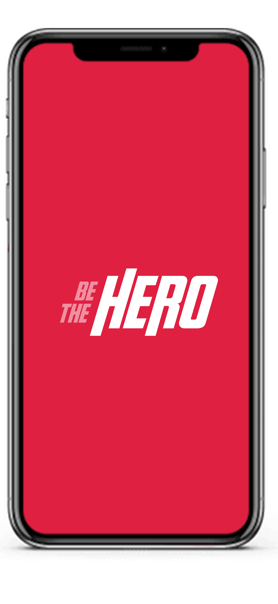

**[INFO]** *This repository is intended only to store the code, all the credits are to [RocketSeat](https://rocketseat.com.br/)©.*

<h1 align="center">
    
</h1>

<h1 align="center">
    
    

</h1>

  <a href="#rocket-description">Introduction</a>&nbsp;&nbsp;&nbsp;|&nbsp;&nbsp;&nbsp;
  <a href="#checkered_flag-getting-started">Getting Started</a>&nbsp;&nbsp;&nbsp;|&nbsp;&nbsp;&nbsp;
  <a href="#prerequisites">Prerequisites</a>&nbsp;&nbsp;&nbsp;|&nbsp;&nbsp;&nbsp;
  <a href="#hammer_and_wrench-build-with">Built with</a>&nbsp;&nbsp;&nbsp;|&nbsp;&nbsp;&nbsp;
  <a href="#memo-license">License</a>

 

## :rocket: Description

### Omnistack 11.0 week

This project was based on the 11th Omnistack  week, from  **[RocketSeat](https://github.com/Rocketseat/semana-omnistack-10)**. The project, *Be The Hero*, consists of an app that aims to connect ongs and people that want to help.

Feel free to suggest improvements and new features. :smile:

 ## :checkered_flag: Getting Started

These instructions will get you a copy of the project up and running on your local machine for development and testing purposes.

### Prerequisites

Firstly, you will need to install:

* [GitHub cli](https://gist.github.com/derhuerst/1b15ff4652a867391f03) :octocat:

* [Node.js](https://nodejs.org/en/download/) 🚀

* [Docker](https://docs.docker.com/v17.09/engine/installation/#server) 🐳

### Installing

A step by step that will guide you on how to run the project on your computer.
...

## :hammer_and_wrench: Built With

* [Node.js](https://nodejs.org/en/download/) - JavaScript interpreter
* [Express](https://expressjs.com/) - Web framework
* [Docker](https://www.docker.com/) - Container environment
* [React](https://www.docker.com/) - Container environment
* [React Native](https://www.docker.com/) - Container environment
* [Expo](https://www.docker.com/) - Container environment

## :memo: License

This project is licensed under the MIT License - see the [LICENSE.md](LICENSE.md) file for details
